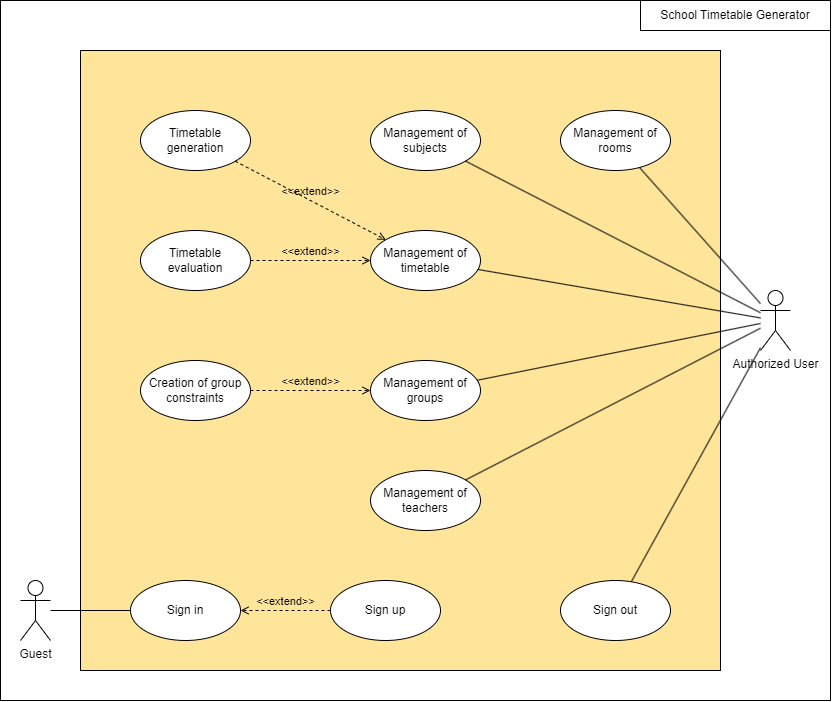
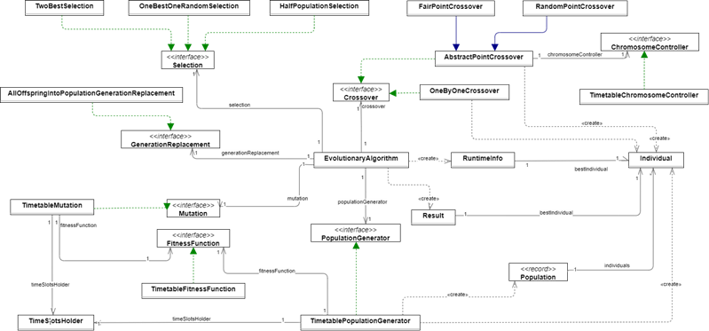
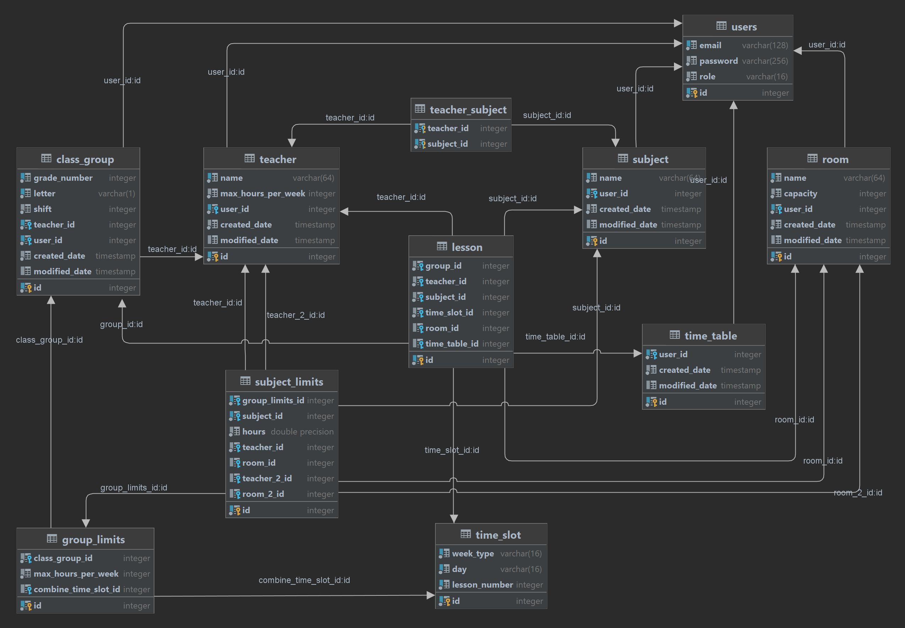
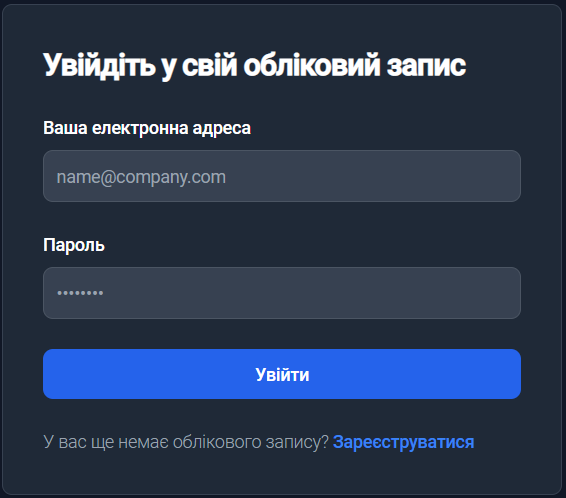
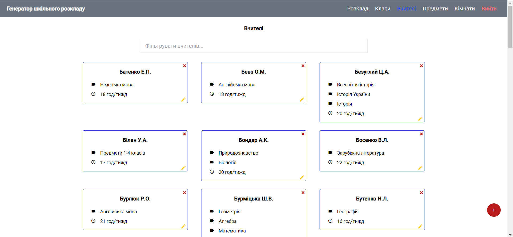
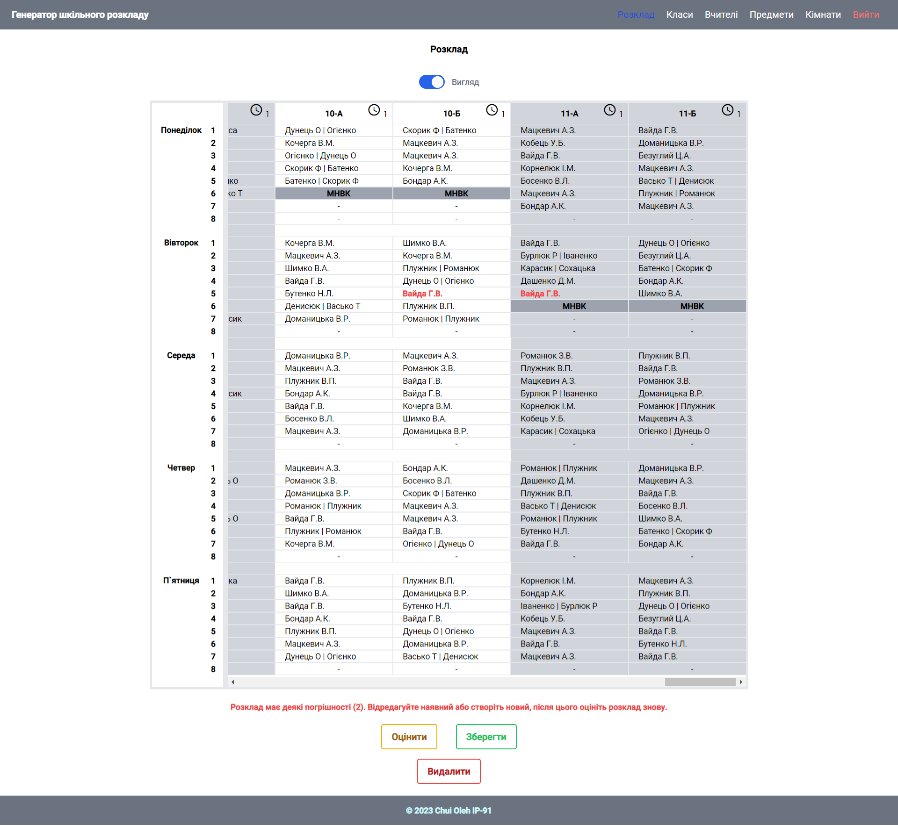

# School Timetable Generator

## Web Application for School Schedule Generation Using Evolutionary Algorithm

This project is created to automate the process of creating a school timetable based on specified requirements.

## Used technologies
Backend:
* Java 17;
* Spring Boot 3.0.2 ;
* Spring MVC 6.0.4;
* Spring Data JPA 3.0.2;
* Spring Security 3.0.2 (authentication - JWT access token);
* Swagger v3;
* Flyway plugin 9.16.1;
* PostgreSQL 15.1.

Frontend:
* Angular 15.0.4;
* Tailwind CSS.

## Use Case diagram:

## Algorithm class diagram:

## DB diagram:

## Screenshots:

## Installation

### You can run application either manually or using docker-compose.

Manually (Java 17, Angular 15.0.4, Node 18.12.1, npm 8.19.2):
* create user in PostgreSQL [username=oleh, password=qwerty];
* create Database [school_timetable] on behalf of user [oleh];
* open terminal in the root of the project;
* cd backend;
* mvn dependency:go-offline;
* mvn clean install;
* mvn spring-boot:run;
* open new terminal in the root of the project;
* cd frontend;
* npm install;
* npm start.

With docker-compose:
* docker compose up -d.

Test users credentials:
1) email = user@gmail.com | pass = Pass1234 (account with filled school information);
2) email = user_2@gmail.com | pass = Pass1234 (empty account).

## License
MIT License

Permission is hereby granted, free of charge, to any person obtaining a copy
of this software and associated documentation files (the "Software"), to deal
in the Software without restriction, including without limitation the rights
to use, copy, modify, merge, publish, distribute, sublicense, and/or sell
copies of the Software, and to permit persons to whom the Software is
furnished to do so, subject to the following conditions:

The above copyright notice and this permission notice shall be included in all
copies or substantial portions of the Software.

THE SOFTWARE IS PROVIDED "AS IS", WITHOUT WARRANTY OF ANY KIND, EXPRESS OR
IMPLIED, INCLUDING BUT NOT LIMITED TO THE WARRANTIES OF MERCHANTABILITY,
FITNESS FOR A PARTICULAR PURPOSE AND NONINFRINGEMENT. IN NO EVENT SHALL THE
AUTHORS OR COPYRIGHT HOLDERS BE LIABLE FOR ANY CLAIM, DAMAGES OR OTHER
LIABILITY, WHETHER IN AN ACTION OF CONTRACT, TORT OR OTHERWISE, ARISING FROM,
OUT OF OR IN CONNECTION WITH THE SOFTWARE OR THE USE OR OTHER DEALINGS IN THE
SOFTWARE.

MIT © [Oleh_Chui]()
